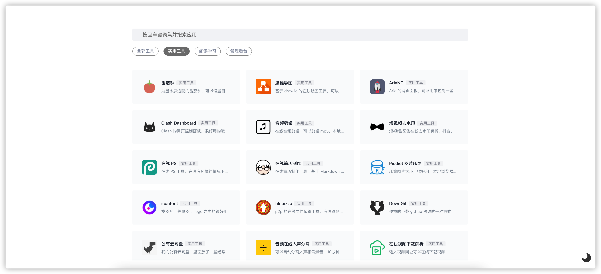
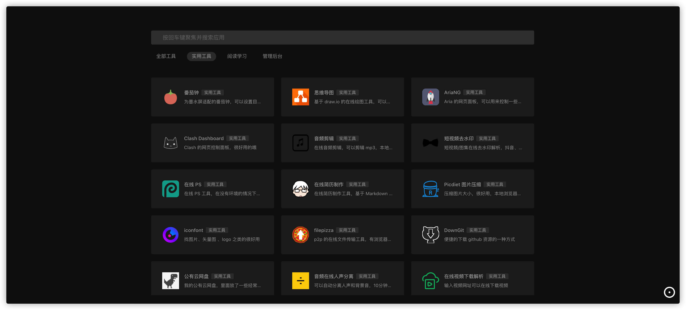
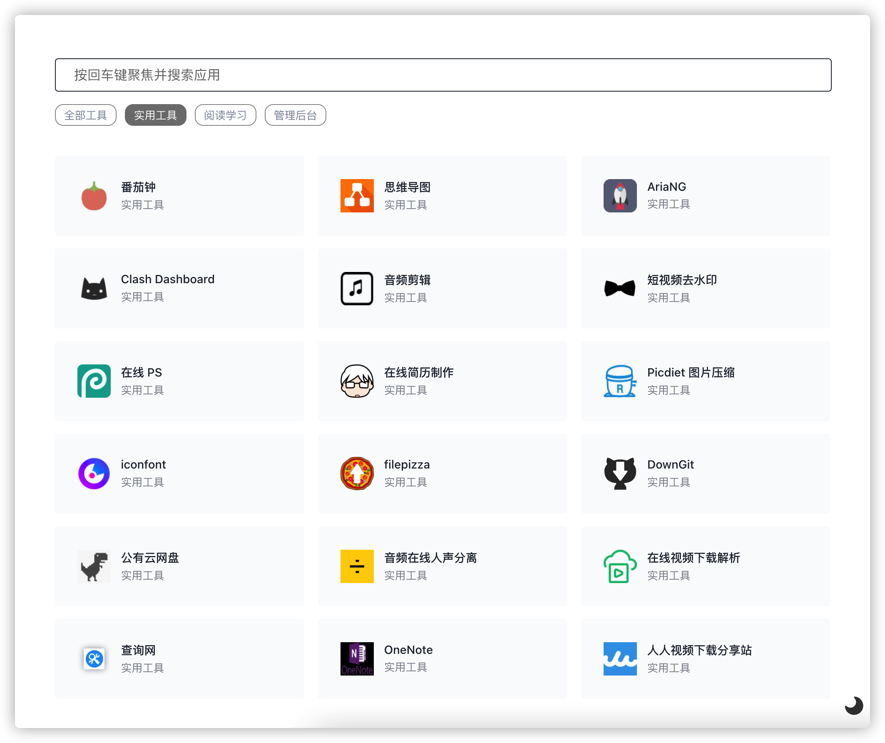
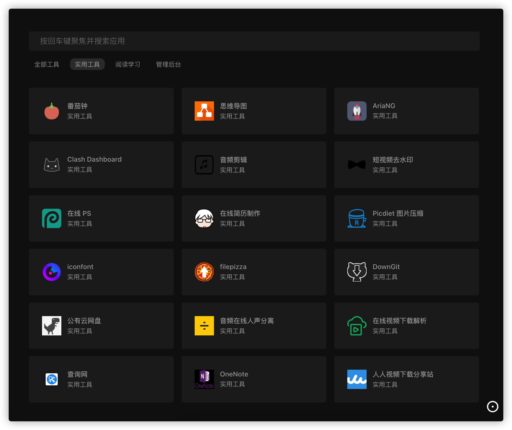
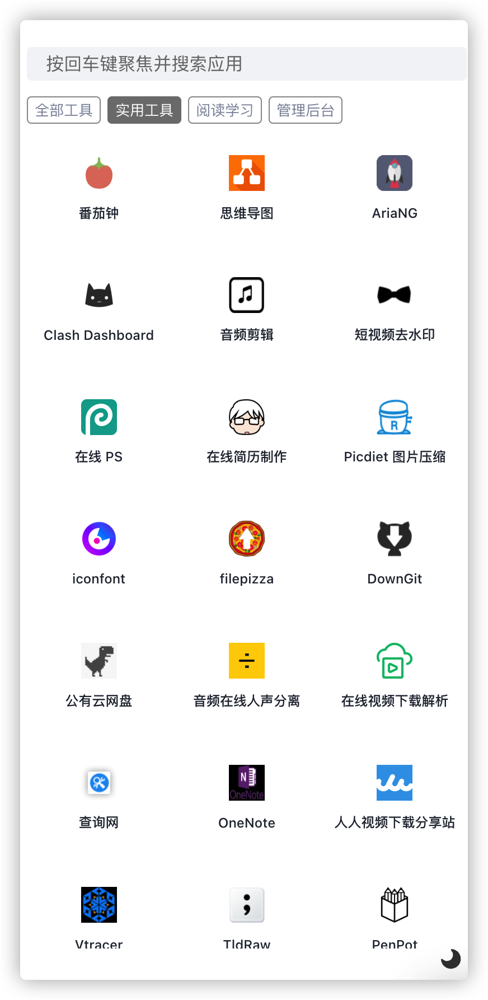
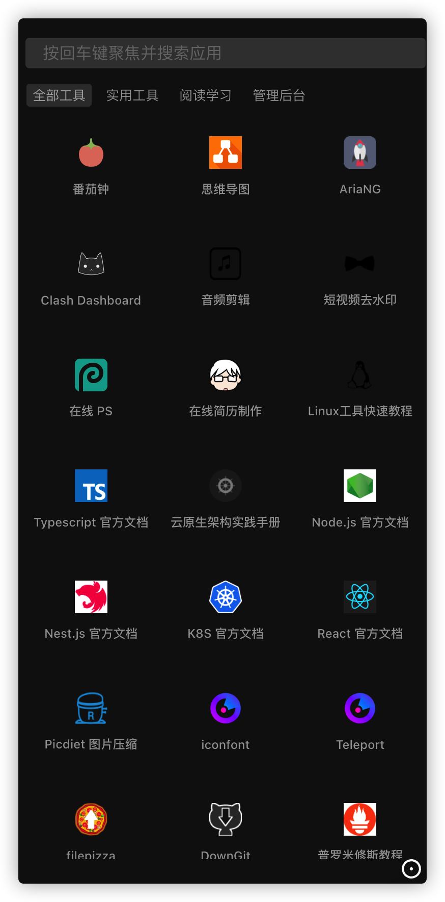
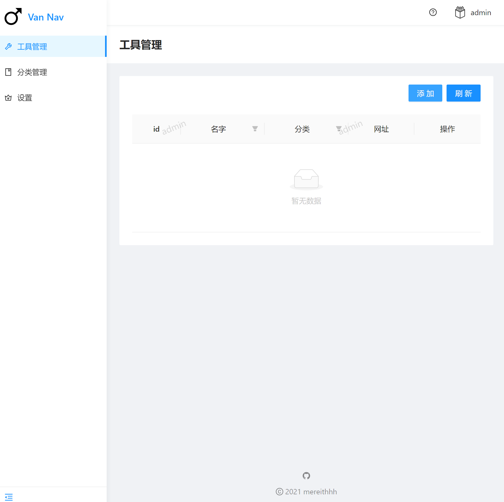

# Van Nav

一个轻量的导航站。

<div style="display:flex; justify-content: center;" ></div>
<div style="display:flex; justify-content: center;" ></div>
<div style="display:flex; justify-content: center;" ></div>
<div style="display:flex; justify-content: center;" ></div>
<div style="display: flex; justify-content: center;"></div>
<div style="display: flex; justify-content: center;"></div>



## 使用方法
### Docker

```
docker run -d --name tools --restart always -p 6412:6412 -v /path/to/your/data:/app/data mereith/van-nav:latest
```

打开浏览器 [http://localhost:6412](http://localhost:6412) 即可访问。

- 默认端口 6412
- 默认账号密码 admin admin ，第一次运行后请进入后台修改
- 数据库会自动创建在当前文件夹中： `nav.db`


### 可执行文件

下载 release 文件夹里面对应平台的二进制文件，直接运行即可。

打开浏览器 [http://localhost:6412](http://localhost:6412) 即可访问。

- 默认端口 6412
- 默认账号密码 admin admin ，第一次运行后请进入后台修改
- 数据库会自动创建在当前文件夹中： `nav.db`

## nginx 反向代理

参考配置

> 其中 `<yourhost>` 和 `<your-cert-path>` 替换成你自己的。

```
server {
    listen 80;
    server_name <yourhost>;
    return 301 https://$host$request_uri;
}

server {
    listen 443   ssl http2;
    server_name <yourhost>;

    ssl_certificate <your-cert-path>
    ssl_certificate_key <your-key-path>;
    ssl_verify_client off;
    proxy_ssl_verify off;
    location / {
        proxy_pass  http://127.0.0.1:6412;
        proxy_set_header Host $http_host;
        proxy_set_header X-Real-IP $remote_addr;
        proxy_set_header X-Forwarded-For $proxy_add_x_forwarded_for;
        proxy_set_header X-Forwarded-Proto $scheme;
        proxy_redirect off;
        proxy_set_header Upgrade $http_upgrade;
    }
}
```
## API
本导航站支持 API，可以用自己的方法添加工具。

文档待完成...
## 状态

可以优化的点太多了，慢慢完善吧……

- [x] 多平台构建流水线
- [x] 定制化 logo 和标题
- [x] 导入导出功能
- [x] 暗色主题切换
- [x] 移动端优化
- [x] 自动获取网站 logo
- [x] 拼音匹配的模糊搜索功能
- [x] 按键直接搜索，搜索后回车直接打开第一项
- [ ] 国际化
- [ ] 浏览器插件
- [ ] 网站状态检测