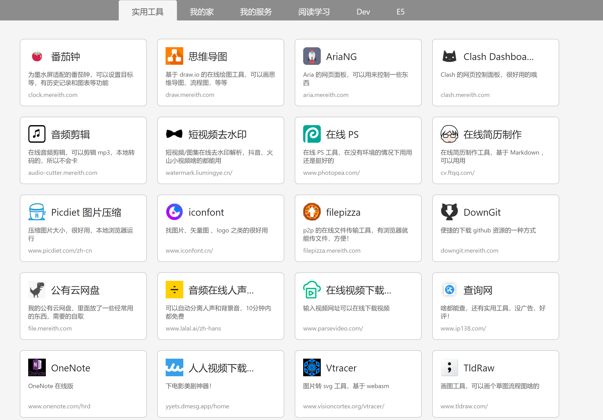
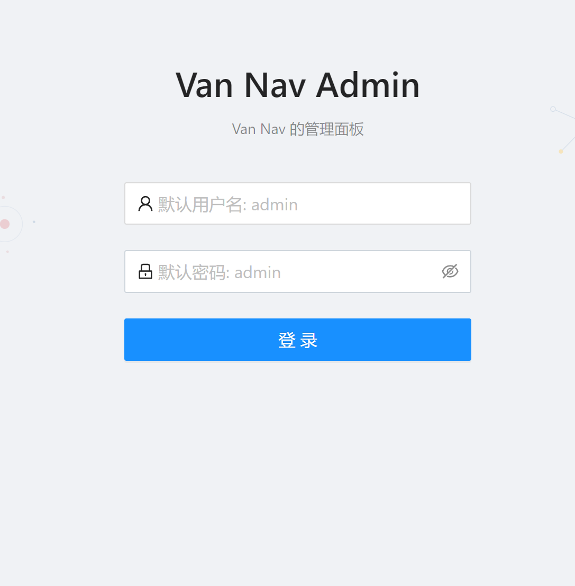
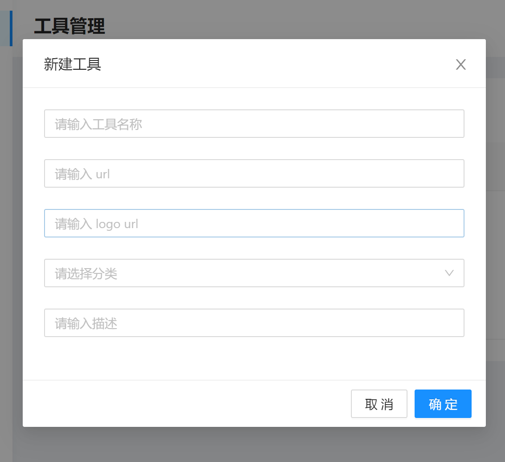

# nav
一个轻量的私人导航站 / 工具站。

## 故事
作为一个喜欢折腾的人，总会时不时的发现什么好项目，尤其是每当 web 项目，第一个想法就是把他拔下来，放到自己的服务器上。23333。

但是网站和项目越来越多，网址太多了记不住，放收藏夹换设备和浏览器或者给别人发的时候不方便（我设备比较多）。

所以就想着做一个自己的导航站（我更想称之为“应用面板”）

于是就有了这个玩意，最开始没想开源写着练手玩的，和我的博客管理面板深度耦合了。后来想解耦，用了 `strapi` 方案，但是有个缺点，打包成镜像太大了，`1.7GB`啊。就一个增删改查的导航站，咱至于吗？

后来用 node 其他框架实现，但是逐渐发现打包和分发不太方便。

那用 go 写？——某一天突发奇想。

于是就有了这个项目~

单独一个二进制文件，支持各种平台，直接运行就搞定，数据库为 `sqlite`，可迁移性很赞。打包成容器也美滋滋，所以就开源咯。

但是因为 go 是刚学的，踩了不少坑，我会慢慢优化代码结构的，暂时就一个 `main.go` 吧。。。

## 使用方法
下载 release 文件夹里面对应平台的二进制文件，直接运行即可。

- 默认端口 8080
- 默认账号密码 admin  admin ，第一次运行后请进入后台修改
- 数据库会自动创建在当前文件夹中： `nav.db`

## 参与项目
可以优化的点太多了，慢慢完善吧……
- [ ] 多平台构建流水线
- [ ] Docker 支持
- [ ] 多平台流水线
- [ ] 私有分类功能，对外隐藏
- [ ] 定制化 logo 和标题
- [ ] 主题切换
- [ ] 移动端优化

