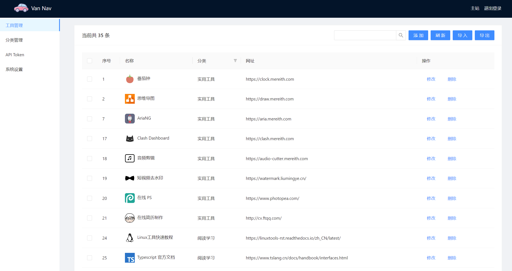

# Van Nav

一个轻量的导航站，现在有搜索引擎集成了，很适合作为主页使用。有配套的[浏览器插件](https://github.com/Mereithhh/van-nav-extension)和 API。 [在线体验](https://demo-tools.mereith.com) (账号密码均为: admin)

<div align=center ></div>
<div align=center ></div>
<div align=center ></div>
<div align=center ></div>
<div align=center></div>
<div align=center></div>
<div align=center></div>

## 使用方法
### Docker

```
docker run -d --name tools --restart always -p 6412:6412 -v /path/to/your/data:/app/data mereith/van-nav:latest
```

打开浏览器 [http://localhost:6412](http://localhost:6412) 即可访问。

- 默认端口 6412
- 默认账号密码 admin admin ，第一次运行后请进入后台修改
- 数据库会自动创建在当前文件夹中： `nav.db`


### 可执行文件

下载 release 文件夹里面对应平台的二进制文件，直接运行即可。

打开浏览器 [http://localhost:6412](http://localhost:6412) 即可访问。

- 默认端口 6412
- 默认账号密码 admin admin ，第一次运行后请进入后台修改
- 数据库会自动创建在当前文件夹中： `nav.db`

### nginx 反向代理

参考配置

> 其中 `<yourhost>` 和 `<your-cert-path>` 替换成你自己的。

```
server {
    listen 80;
    server_name <yourhost>;
    return 301 https://$host$request_uri;
}

server {
    listen 443   ssl http2;
    server_name <yourhost>;

    ssl_certificate <your-cert-path>
    ssl_certificate_key <your-key-path>;
    ssl_verify_client off;
    proxy_ssl_verify off;
    location / {
        proxy_pass  http://127.0.0.1:6412;
        proxy_set_header Host $http_host;
        proxy_set_header X-Real-IP $remote_addr;
        proxy_set_header X-Forwarded-For $proxy_add_x_forwarded_for;
        proxy_set_header X-Forwarded-Proto $scheme;
        proxy_redirect off;
        proxy_set_header Upgrade $http_upgrade;
    }
}
```

### systemd 服务
可以注册成系统服务，开机启动。

1. 复制二进制文件到 `/usr/local/bin` 目录下，并加上执行权限

2. 新建 `VanNav.serivce` 文件于 `/usr/lib/systemd/system` 目录下:
```
[Unit]
Description=VanNav
Documentation=https://github.com/mereithhh/van-nav
After=network.target
Wants=network.target

[Service]
WorkingDirectory=/usr/local/bin
ExecStart=/usr/local/bin/nav
Restart=on-abnormal
RestartSec=5s
KillMode=mixed

StandardOutput=null
StandardError=syslog

[Install]
WantedBy=multi-user.target
```

3. 执行:
```
sudo systemctl daemon-reload && sudo systemctl enable --now VanNav.service
```

## 浏览器插件
具体请看： [浏览器插件仓库](https://github.com/Mereithhh/van-nav-extension)

具有一键增加工具，快速打开管理后台和主站等功能。具体自行探索哦。
## API
本导航站支持 API，可以用自己的方法添加工具。

文档待完成...
## 状态

可以优化的点太多了，慢慢完善吧……

- [x] 多平台构建流水线
- [x] 定制化 logo 和标题
- [x] 导入导出功能
- [x] 暗色主题切换
- [x] 移动端优化
- [x] 自动获取网站 logo
- [x] 拼音匹配的模糊搜索功能
- [x] 按键直接搜索，搜索后回车直接打开第一项
- [x] 图片存库，避免跨域和加载慢的问题
- [x] gzip 全局压缩
- [x] 中文 url 图片修复
- [x] svg 图片修复
- [x] 浏览器插件
- [x] 自动获取网站题目和描述等信息
- [x] 后台按钮可自定义隐藏
- [x] github 按钮可隐藏
- [x] 支持登录后才能查看的隐藏卡片
- [x] 搜索引擎集成功能
- [ ] 自动主题切换
- [ ] 国际化
- [ ] 增加 ServiceWork ,离线可用,可安装
- [ ] 网站状态检测
